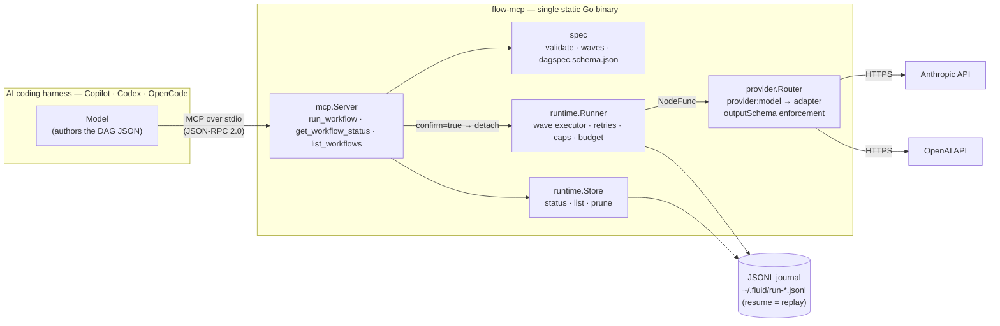

# fluid

Model-agnostic dynamic workflows for AI coding harnesses — GitHub Copilot,
OpenAI Codex, and OpenCode — via MCP.

Your harness's own model drafts a JSON DAG of agent nodes ("review these three
modules in parallel, then synthesize"); fluid validates it, executes it in
dependency-ordered waves against real model providers, enforces caps and
per-node output schemas, and journals every step so interrupted runs resume
without repeating completed work. One static Go binary. No Node, no Docker,
no sidecars.



## Install

Download a release binary and put it on your PATH, or [build from
source](#build-from-source) (one command — fluid has zero runtime
dependencies).

Then add it to your harness — model API keys go in the harness's MCP `env`
block, never in files:

**GitHub Copilot CLI** — `~/.copilot/mcp-config.json`

```json
{"mcpServers": {"fluid": {"type": "local", "command": "flow-mcp",
  "env": {"ANTHROPIC_API_KEY": "...", "OPENAI_API_KEY": "..."}, "tools": ["*"]}}}
```

**OpenAI Codex** — `~/.codex/config.toml`

```toml
[mcp_servers.fluid]
command = "flow-mcp"
env = { ANTHROPIC_API_KEY = "...", OPENAI_API_KEY = "..." }
```

**OpenCode** — `opencode.json`

```json
{"mcp": {"fluid": {"type": "local", "command": ["flow-mcp"],
  "environment": {"ANTHROPIC_API_KEY": "...", "OPENAI_API_KEY": "..."}, "enabled": true}}}
```

Reload the harness; three tools appear: `run_workflow`, `get_workflow_status`,
`list_workflows`. Ask for a fan-out in natural language, approve the tool
call, and poll status. Every tool call returns in milliseconds — runs execute
in the background, so no harness tool timeout is ever at risk.

## The tools

| Tool | What it does |
| --- | --- |
| `run_workflow` | `confirm=false` validates and previews execution waves; `confirm=true` starts the run and returns a `run_id` immediately; `run_id=...` resumes an interrupted run. The DAG JSON Schema is embedded in the tool description, so the calling model authors DAGs natively. |
| `get_workflow_status` | Run + per-node states, attempts, timestamps, tokens spent, failure reasons. |
| `list_workflows` | Recent runs, newest first; filter by state. |

Operations: state lives in `~/.fluid` (override: `FLOW_STATE_DIR`);
`flow-mcp prune -days 30` deletes old terminal runs; diagnostics go to stderr
(your harness's MCP log), stdout is protocol-only.

## Build from source

Prerequisites: Go ≥ 1.24 and git — nothing else. fluid is stdlib-only (no
module downloads, no CGO), so builds work fully offline.

```bash
git clone https://github.com/Cloud-Byte-Consulting/fluid.git
cd fluid

# verify before building (recommended)
go vet ./... && go test ./... -race

# build with version stamping
go build -trimpath \
  -ldflags "-s -w -X main.version=$(git describe --tags --always) -X main.commit=$(git rev-parse --short HEAD)" \
  -o flow-mcp ./cmd/flow-mcp

./flow-mcp version                      # e.g. flow-mcp ad6a001 (ad6a001)
sudo install -m 0755 flow-mcp /usr/local/bin/   # or copy anywhere on PATH
```

Quick variants:

```bash
go build -o flow-mcp ./cmd/flow-mcp     # plain build (version reports "dev")
go install github.com/Cloud-Byte-Consulting/fluid/cmd/flow-mcp@latest   # straight to $GOBIN
```

Cross-compile for any Iteration 1 platform — the binary is static:

```bash
CGO_ENABLED=0 GOOS=darwin  GOARCH=arm64 go build -o flow-mcp-darwin-arm64  ./cmd/flow-mcp
CGO_ENABLED=0 GOOS=linux   GOARCH=amd64 go build -o flow-mcp-linux-amd64   ./cmd/flow-mcp
CGO_ENABLED=0 GOOS=windows GOARCH=amd64 go build -o flow-mcp-windows.exe   ./cmd/flow-mcp
```

Tagged releases (`v*`) run this same matrix in CI and publish binaries with
checksums — see `.github/workflows/release.yml`.

## Layout

- `spec/` — the language-neutral DAG contract: types, one-pass validation
  (identity, references, caps, cycles), deterministic execution waves, and the
  published `dagspec.schema.json` (drift-guarded against the Go types).
- `runtime/` — wave executor with retry classification (`Transient`),
  bounded backoff, token-budget enforcement, cancellation, and a JSONL
  journal; `Store` derives status/list/prune purely from journal replay.
- `provider/` — `"provider:model"` router (Anthropic, OpenAI), typed
  transient/permanent errors, and outputSchema enforcement with bounded
  corrective retries.
- `jsonschema/` — minimal structural JSON Schema validator (shared by spec,
  provider, and MCP input validation).
- `mcp/` — dependency-free MCP stdio server (JSON-RPC 2.0) exposing the three
  tools.
- `cmd/flow-mcp/` — the binary: serve (default), `version`, `prune`.
- `docs/` — [architecture](docs/architecture.md),
  [local deployment](docs/local.md), and cloud scale-out for
  [Azure](docs/deploy-azure.md), [AWS](docs/deploy-aws.md),
  [GCP](docs/deploy-gcp.md).

## Develop

```bash
go vet ./...
go test ./... -race
```

TDD with scenario-named tests mapped to Gherkin acceptance criteria in the
Linear work items (project **Fluid**). Ginkgo/Gomega migration is tracked
(CLO-209). CI runs vet + race-enabled tests on every push; tagging `v*`
builds and publishes release binaries for darwin/linux/windows.
