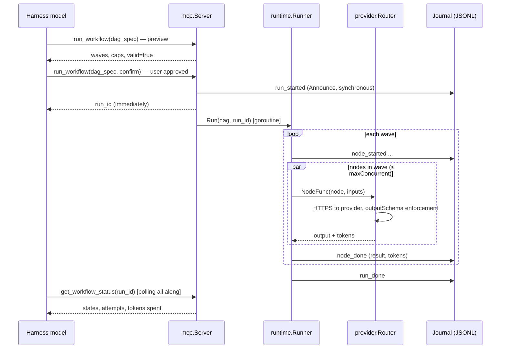
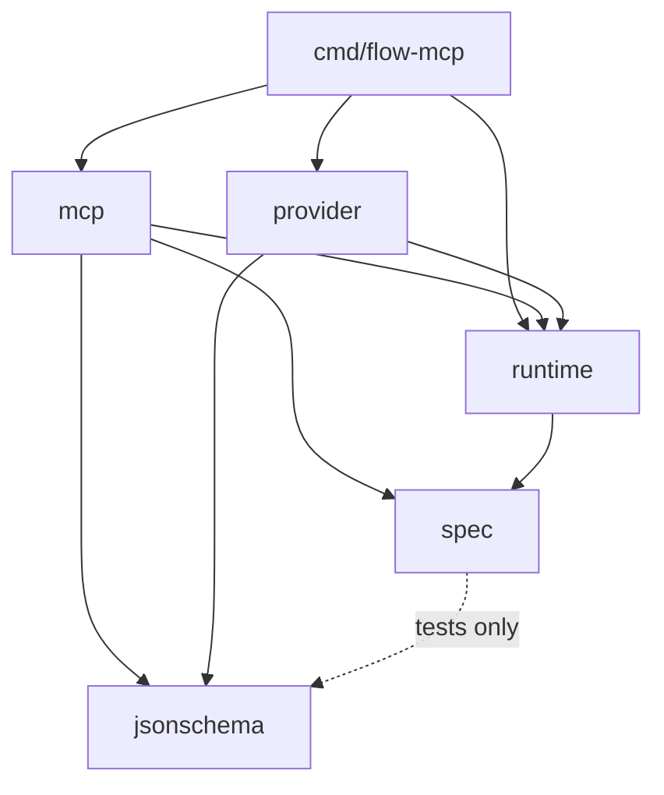

# Architecture

fluid replicates the shape of Claude Code's dynamic workflows for any
MCP-capable harness: the calling model authors the orchestration (a JSON DAG),
a decoupled runtime executes it durably, and runs are resumable and
observable by id.

## Design constraints (binding)

1. **Async by construction.** Harnesses assume short synchronous tool calls
   (Codex's default `tool_timeout_sec` is 60; OpenCode's tool-fetch timeout is
   5 s). No fluid tool call may block on run completion: `run_workflow`
   returns a `run_id` immediately and the model polls `get_workflow_status`.
2. **The journal is the only truth.** Every state transition is an appended
   JSONL event; status, listing, resume, and prune are all journal replay.
   A crash at any byte loses at most one partial line (tolerated on read).
3. **The harness is the approval UI.** No token/digest ceremony — the
   native tool-approval prompt plus an explicit `confirm` parameter is the
   human gate.
4. **Model-agnostic at every node.** `"provider:model"` strings route each
   node independently; `defaultModel` covers the rest. Credentials come only
   from the environment the harness supplies.

## Run lifecycle

Failure paths: a transient node error (429/5xx/timeout) retries with backoff
up to `maxRounds`; a permanent error fails the run (`run_failed`), keeping
completed results; cancellation (signal or context) journals `run_cancelled`;
crossing `tokenBudget` blocks the next wave with `budget_exceeded`. In every
case, re-invoking `run_workflow` with the same `run_id` resumes from the
journal — completed nodes never re-execute.

## Package dependency graph

`spec` is the contract, dependency-free. `runtime` knows nothing about MCP or
providers (`NodeFunc` is the seam — tests inject fakes, production injects
`provider.Router.Exec`, and a future durabletask-go engine slots in behind
the same signature).

## Scale-out path

The local engine is deliberately shaped like a durable-task orchestration
(waves = `whenAll` fan-out, journal = history replay). The upgrade path
keeps the MCP contract identical and swaps the engine/state:

| Mode | Engine | State | Doc |
| --- | --- | --- | --- |
| Local (this repo, default) | built-in wave executor | JSONL in `~/.fluid` | [local.md](local.md) |
| Hybrid / cloud on Azure | durabletask-go | Azure Durable Task Scheduler task hub | [deploy-azure.md](deploy-azure.md) |
| Hybrid / cloud on AWS | durabletask-go + Postgres backend | Aurora / RDS | [deploy-aws.md](deploy-aws.md) |
| Hybrid / cloud on GCP | durabletask-go + Postgres backend | Cloud SQL / AlloyDB | [deploy-gcp.md](deploy-gcp.md) |
